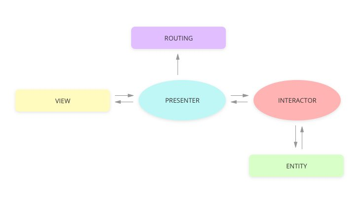

# VIPER Architecture
[](https://shields.io/) [](https://shields.io/)

### Overview
VIPER is a clean artchitecture that splits the application's logical structure into several responsibility groups. This helps decouple the system and increase the unit testing availability of all groups.  



*image reference: [MINDSTUDIOS](https://themindstudios.com/blog/mvp-vs-mvc-vs-mvvm-vs-viper/)*

### View
```swift
let view: ViewProtocol
```
- Responsible for receiving user actions and pass them to the **Presenter**.
- On the opposite direction, it receives responses from the **Presenter** and change its UI respectively.

### Interactor
```swift
let interactor: InteractorInputProtocol
```
- Receives requests sent from the **Presenter**, then contacts the **Entity** to read/write the data.
- Once the results are returned from the **Entity**, the **Interactor** uses call back functions to inform **Presenter** the results.

### Presenter
```swift
let presenter: PresenterProtocol & InteractorOutputProtocol
```
- **Presenter** is responsible for reacting to the user interactions from the **View**. 
- Once the **Presenter** receives an user action, it either sends requests to interactor to get the necessary data or calls functions in **Router** to perform navigation to other views.

### Entity
```swift
let localDataManager: LocalDataManagerInputProtocol
let RemoteDataManager: RemoteDataManagerInputProtocol
```
- Consists data objects and APIs that are controlled and manipulated by **Interactors**. 

### Router
```swift
let router: RouterProtocol
```
- Responsible for navigation between all of the screens. 
- Also called Wireframe.

### Dependencies
#### View.class
```swift
var presenter: PresenterProtocol?
```
#### Interactor.class
```swift
weak var presenter: InteractorOutputProtocol?

var localDataManager: LocalDataManagerInputProtocol?

var remoteDataManager: RemoteDataManagerInputProtocol?
```
#### Presenter.class
```swift
weak var view: ViewProtocol?

var interactor: InteractorInputProtocol?
```
#### Entities
```swift
class RemoteDataManager: RemoteDataManagerInputProtocol {}  

class LocalDataManager: LocalDataManagerInputProtocol {}

struct DataObject {}
```
#### Router.class
```swift
static func createModule() 

func presentOtherViewController()
```

### References
- [MINDSTUDIOS](https://themindstudios.com/blog/mvp-vs-mvc-vs-mvvm-vs-viper/)
- [amitshekhariitbhu](https://github.com/MindorksOpenSource/iOS-Viper-Architecture)
