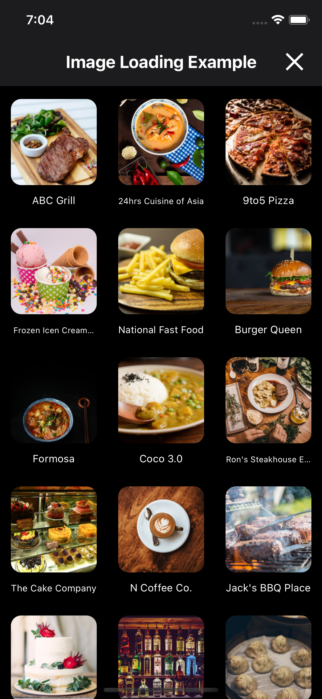
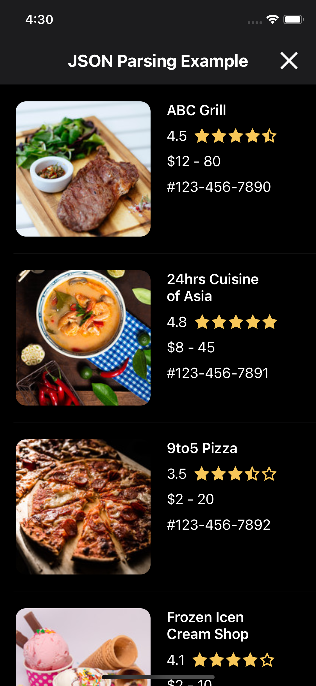
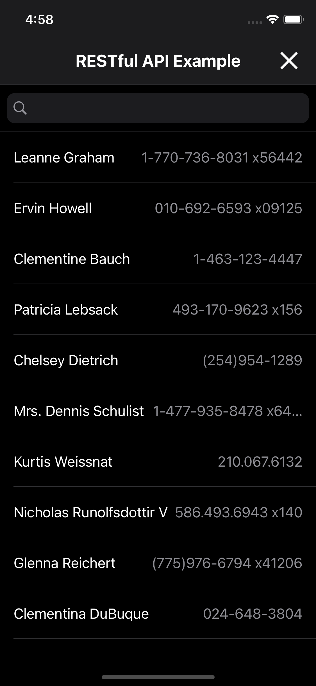
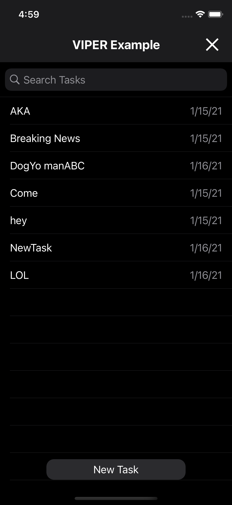
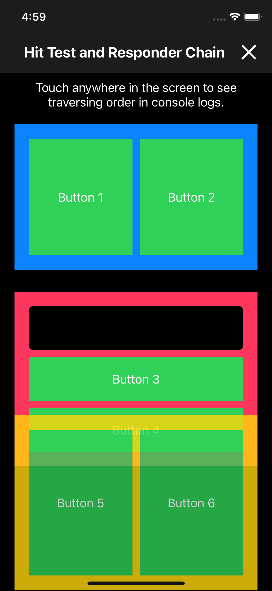
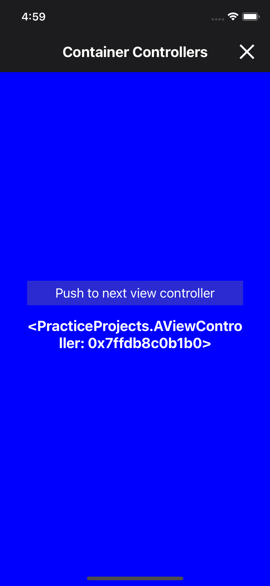

# iOS Sample Projects
[](https://shields.io/) [](https://shields.io/)  [](https://shields.io/) 

## Overview
- [Image Loading Example](PracticeProjects/ImageLoadingExample)
- [JSON Parsing Example](PracticeProjects/JSONDecodingExample)
- [Restful API Example](PracticeProjects/RestAPIExample)
- [VIPER Example](PracticeProjects/VIPERExample)
- [Hit Test and Resonder Chain](PracticeProjects/HitTestExample)
- [Grand Central Dispatch and Lock/Deadlock Example](PracticeProjects/GCDExample)
- [Container Controller Example](PracticeProjects/ContainerControllerExample)

## Image Loading Example

<table>
<tr>
<td align="center">
 
</td>
<td>

<ul>
<li>MVC Architecture</li>
<li>Asynchonous image loading mechanism</li>
<li>Use collection view to display images</li>
<li>Reuse mechanism of collection view cell</li>
<li>Unit tests</li>
</ul>
</td>
</tr>
</table>

## JSON Parsing Example

<table>
<tr>
<td align="center">

</td>
<td>

<ul>
<li>MVC Architecture</li>
<li>Implementation of Codable</li>
<li>Decode JSON data</li>
<li>Use table view to display JSON objects</li>
<li>State-driven table view</li>
<li>Asynchonous image loading in table view</li>
<li>Rating view (5 stars)</li>
<li>Unit tests</li>
</ul>
</td>
</tr>
</table>

## Restful API Example
<table>
<tr>
<td align="center">

</td>
<td>

<ul>
<li>MVVM Architecture</li>
<li>Implementation of Codable</li>
<li>Query data from backend</li>
<li>JSON decoding</li>
<li>Use of default search bar</li>
<li>State-driven table view</li>
<li>Unit tests</li></ul>
</td>
</tr>
</table>

## VIPER Example

<table>
<tr>
<td align="center">

</td>
<td>

<ul>
<li>VIPER Architecture</li>
<li>Core Data store</li>
<li>State-driven table view</li>
<li>Auto query mechanism</li>
</ul>
</td>
</tr>
</table>

## Hit Test and Resonder Chain

<table>
<tr>
<td align="center">

</td>
<td>

<ul>
<li>Hit test sequence print out</li>
<li>Responder chain sequence print out</li>
<li>Use storyboard to layout UI</li>
</ul>
</td>
</tr>
</table>

## Grand Central Dispatch and Lock/Deadlock Example
<table>
<tr>
<td align="left" width="300">

```swift
/**
Examples
1. deadlockExample1()
2. deadlockExample2()
3. barrierExample()
4. dispatchGroupExample()
5. dispatchGroupNotifyExample()
*/
print("Put a break point on this line.")
// Call the above method to see results.
```

</td>
<td>

<ul>
<li>Deadlock examples</li>
<li>Implementation of read-write lock</li>
<li>Implementation of dispatch group</li>
<li>Implmentation of async barrier</li>
</ul>
</td>
</tr>
</table>

## Container Controller Example
<table>
<tr>
<td align="center">

</td>
<td>

<ul>
<li>Implementation of reusable navigation controller</li>
<li>Controller reusable mechanism</li>
<li>Controller caching</li>
</ul>
</td>
</tr>
</table>

## Reference
- [raywenderlich](https://www.raywenderlich.com/)
- [donnywals](https://www.donnywals.com/)
- [imgbb](https://imgbb.com/)
- [Apple](https://developer.apple.com/)
